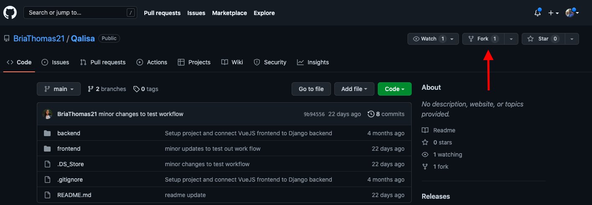

# Qalisa

A learning experience designed for junior developers to land and succeed in tech roles

## Workflow Instructions

To contribute...

1. Fork the repository from https://github.com/BriaThomas21/Qalisa




2. Run the following command to clone the forked repository to your computer (Only necessary during initial setup): 
    ```bash
    git clone https://github.com/<YourGithubUsername>/Qalisa.git
    ```

3. Once the project has been cloned, from your terminal, change directories to the project directory using the following commands (if project folder lives on your Desktop... If not, navigate to the folder that your project folder lives in, then change to the project folder directory):
    ```bash
    cd Desktop
    cd Qalisa
    ```

4. Once you've navigated to the project folder, make sure you're working with the latest version of the project by using the following command:
    ```bash
    git pull
    ```

5. Navigate to the "frontend" folder by running the first of the following commands, then run the second of the following commands to ensure you have all project dependencies installed:
    ```bash
    cd frontend
    npm install
    ```

6. You can check that this was sucessful by running ```npm run serve``` while in the "frontend" folder.

7. Navigate back to the root project folder ("Qalisa") and open your code editor to access the entire codebase (the below is for VSCode users):
    ```bash
    cd ..
    code .
    ```

8. To create and switch to a new branch, use the following command:
    ```bash
    git checkout -b <name-of-feature-you-are-working-on>
    ```

9. Use git branch to ensure you have been switched to your new branch:
    ```bash
    git branch
    ```

10. Make changes to the codebase, then add and commit your code and push it to your remote feature branch using the following commands:
    ```bash
    git add .
    git commit -m "Commit Message"
    git push --set-upstream origin <feature-branch-name>
    ```

11. Finally, create a pull request via Github by going to the feature branch of your forked repository and clicking the "Create pull request" button. All pull requests should be made to the base repository's "staging" branch.

12. Once your pull request has been approved and merged into staging, you may delete your feature branch from your forked repository.

## How to Install and Run 
use this command: npm run serve 
use url in browser
##

## Workflow
push to staging environment

